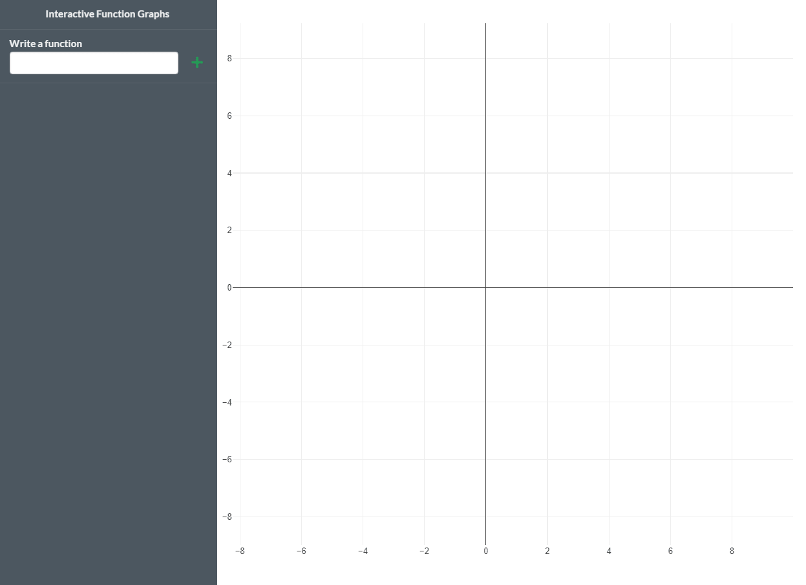

# ifuns

<!-- badges: start -->
<!-- badges: end -->

This package contains a Shiny app to interactively visualize univariate functions. To install the package

```r
# install.packages("remotes")
remotes::install_github("tomicapretto/ifuns")
```

And fire the app with 

```r
ifuns::launch()
```

This is a simple demonstration of how you can use the app.




# Notes

While the app works, this is a more like a proof of concept than a final version
anyone could use to assist calculus teaching. Here I list some of the drawbacks that,
hopefully, we could tackle in the future

1. Every function is computed along the same bounded grid of values. In the future
I would like to implement something to obtain the domain of a function and assign
each function a specific grid based on that domain.
1. The function is (re) computed along the same grid no matter if you're zooming in 
a specific part of the domain. I would like to compute each function only where it
is being shown.
1. The plot height is fixed at 800px. 
1. ... something I've missed?


